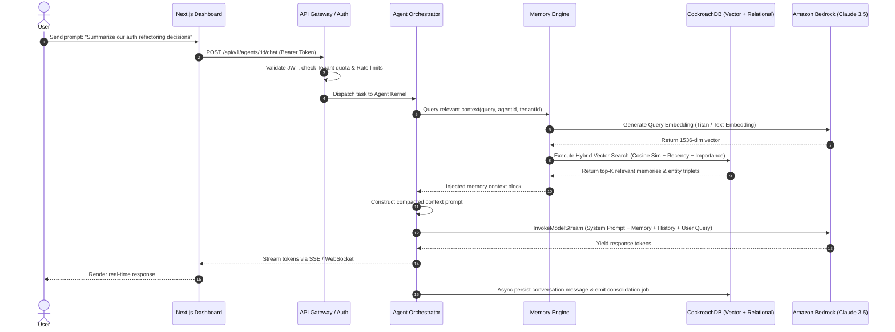

# MemOS — System Architecture

## 1. Executive Summary & High-Level Architecture

**MemOS** is a distributed, production-grade persistent memory operating system for autonomous AI agents, powered by **CockroachDB** (for multi-region transactional consistency and distributed vector search) and **AWS** (Amazon Bedrock for foundation model reasoning, Amazon S3 for unstructured blob storage, Amazon CloudWatch for enterprise observability, and AWS Secrets Manager for secret lifecycle management).

Traditional LLMs suffer from transient context windows: once a session concludes, state and learned facts evaporate. MemOS provides an intelligent cognitive subsystem that automatically intercepts, decomposes, embeds, structures, and indexes conversational episodic facts, semantic world models, and procedural execution traces into a durable, horizontally scalable memory substrate.

```
                                  ┌─────────────────────────────────────────────────────────┐
                                  │                     CLIENT LAYER                        │
                                  │  Next.js 15 (React 19) Dashboard  │  SDK / CLI / IDE    │
                                  └────────────────────────────┬────────────────────────────┘
                                                               │  HTTPS / WSS (TLS 1.3)
                                                               ▼
                                  ┌─────────────────────────────────────────────────────────┐
                                  │                   API GATEWAY & SEC                     │
                                  │  • Rate Limiter (Token Bucket)  • JWT & API Key Auth    │
                                  │  • Request Validation (Zod)     • Correlation IDs       │
                                  └────────────────────────────┬────────────────────────────┘
                                                               │
                                                               ▼
                                  ┌─────────────────────────────────────────────────────────┐
                                  │                MEMOS BACKEND APPLICATION               │
                                  │                                                         │
                                  │   ┌───────────────────┐       ┌──────────────────────┐  │
                                  │   │   AGENT RUNTIME   │       │    MEMORY ENGINE     │  │
                                  │   │ • Planner (DAG)   │◄─────►│ • Episodic / Semantic│  │
                                  │   │ • ReAct Executor  │       │ • Procedural Engine  │  │
                                  │   │ • MCP Protocol    │       │ • Dynamic Decay Math │  │
                                  │   │ • Context Manager │       │ • Knowledge Graph    │  │
                                  │   └─────────┬─────────┘       └──────────┬───────────┘  │
                                  │             │                            │              │
                                  │             ▼                            ▼              │
                                  │   ┌──────────────────────────────────────────────────┐  │
                                  │   │              ASYNC WORKER SUBSYSTEM              │  │
                                  │   │  • Memory Consolidation  • Decay Recalculation   │  │
                                  │   │  • Graph Triplet Linker  • S3 Document Indexer   │  │
                                  │   └──────────────────────────────────────────────────┘  │
                                  └────────────────────────────┬────────────────────────────┘
                                                               │
                                ┌──────────────────────────────┴──────────────────────────────┐
                                │                                                             │
                                ▼                                                             ▼
┌───────────────────────────────────────────────────────┐   ┌───────────────────────────────────────────────────────┐
│                 COCKROACHDB CLUSTER                   │   │                     AWS CLOUD                         │
│ • Distributed Relational Schema (Postgres 16 wire)   │   │ • Amazon Bedrock (Claude 3.5 Sonnet / Titan Embed)    │
│ • Distributed Vector Storage & Cosine Distance Index  │   │ • Amazon S3 (Document storage & raw memory blobs)     │
│ • Multi-tenant Isolation (Row-Level / Tenant Keyed)   │   │ • Amazon CloudWatch (Logs, metrics, trace telemetry)  │
│ • ACID Serializable Transactions with Retry Loop      │   │ • AWS Secrets Manager (Credentials & API keys)        │
└───────────────────────────────────────────────────────┘   └───────────────────────────────────────────────────────┘
```

---

## 2. Low-Level Architecture & Component Decomposition

MemOS is organized under **Clean Architecture** and **Domain-Driven Design (DDD)** paradigms:

```
apps/api/src/
├── config/             # Environment, Winston logger, AWS client configs
├── db/                 # CockroachDB pool connection, Drizzle schemas, migrations, seeders
├── middleware/         # Auth, Rate Limiter, Correlation ID, Error handler, Audit logger
├── repositories/       # Isolated DB access queries (Tenants, Users, Agents, Memories, Graph)
├── services/           # Core domain logic (Auth, Agent, Memory, Project, Analytics)
├── memory/             # Vector embeddings, dynamic decay scoring math, knowledge graph engine
├── agent/              # Planner, ReAct Executor, Tool Registry, MCP Client, Context Window
├── workers/            # Ingestion, consolidation, decay recalculation background workers
├── controllers/        # HTTP REST controllers & DTO request mappers
├── websocket/          # Socket.io / SSE handlers for live token streaming & memory updates
├── routes/             # Express route declarations with OpenAPI metadata
└── server.ts           # Bootstrapping & graceful shutdown handler
```

### 2.1 Component Interaction Matrix

| Subsystem | Responsibilities | Upstream Dependencies | Downstream Dependencies |
| :--- | :--- | :--- | :--- |
| **API Gateway** | TLS Termination, Rate limiting, JWT/API Key auth, Zod validation | External Clients, Web Dashboard | Agent Runtime, Memory Engine |
| **Agent Runtime** | Goal decomposition (DAG), step execution, tool calling, MCP tool invocation | API Gateway, WebSocket Controller | Bedrock LLM, Memory Engine, MCP Servers |
| **Memory Engine** | Vector embedding generation, hybrid semantic + decay scoring, entity graph extraction | Agent Runtime, Worker Queue | CockroachDB, Amazon Bedrock |
| **Storage Layer** | Relational transactions, vector indexing, row-level tenant security | Memory Engine, Repositories | CockroachDB Cluster, Amazon S3 |
| **Worker Queue** | Async memory consolidation, time decay updates, batch document ingestion | Agent Runtime Events | Memory Engine, CockroachDB |

---

## 3. End-to-End Execution & Request Flows

### 3.1 Synchronous User Query & Dynamic Memory Injection Flow



### 3.2 Asynchronous Memory Consolidation & Decay Pipeline

```mermaid
graph TD
    A[Agent Chat Concluded] --> B[Push Event to Memory-Consolidation Queue]
    B --> C[Worker Picks Up Job]
    C --> D[Fetch Sliding Buffer of Recent Messages]
    D --> E[Call Amazon Bedrock LLM for Fact & Entity Extraction]
    E --> F{Extracted Items}
    F -->|Semantic Facts| G[Generate Embeddings & Save to long_term_memories]
    F -->|Entity Triplets| H[Upsert into entities and entity_relations]
    F -->|Procedural Workflows| I[Save execution templates]
    G --> J[Index in CockroachDB Vector Space]
    H --> J
    I --> J
    K[Cron Scheduler / Decay Worker] --> L[Calculate e^(-λ * Δt) * Importance]
    L --> M[Batch Update Memory Retrieval Ranks in CockroachDB]
```

---

## 4. CockroachDB Architecture & Distributed Vector Indexing

CockroachDB serves as the foundational data backbone for MemOS, providing:
1. **Multi-Region Distributed Consistency**: ACID serializable guarantees across geo-distributed nodes without single-point-of-failure bottlenecks.
2. **PostgreSQL Compatibility**: Full wire and query compatibility enabling seamless integration with Drizzle ORM and standard node-postgres drivers.
3. **Distributed Vector Indexing**: MemOS utilizes vector columns with cosine distance operators (`<=>` or `<->`) and inverted HNSW-compatible indexes to enable millisecond vector search across millions of agent memory nodes.
4. **Transaction Retry Resilience**: Implemented client-side retry wrappers intercepting transaction retry errors (PostgreSQL error code `40001` / `CRDB_RETRY`) with exponential backoff and jitter.

### 4.1 CockroachDB Schema Topography

```
                    ┌─────────────────────────┐
                    │         tenants         │
                    └────────────┬────────────┘
                                 │ 1:N
        ┌────────────────────────┼────────────────────────┐
        ▼                        ▼                        ▼
┌───────────────┐        ┌───────────────┐        ┌───────────────┐
│     users     │        │   api_keys    │        │   projects    │
└───────┬───────┘        └───────────────┘        └───────┬───────┘
        │ 1:N                                             │ 1:N
        ▼                                                 ▼
┌───────────────┐ 1:N    ┌───────────────┐        ┌───────────────┐
│  audit_logs   │◄───────┤    agents     │◄───────┤   documents   │
└───────────────┘        └───────┬───────┘        └───────────────┘
                                 │ 1:N
        ┌────────────────────────┼────────────────────────┐
        ▼                        ▼                        ▼
┌───────────────┐        ┌───────────────┐        ┌───────────────┐
│   sessions    │        │long_term_mem  │        │   entities    │
└───────┬───────┘        └───────────────┘        └───────┬───────┘
        │ 1:N                                             │ 1:N
        ▼                                                 ▼
┌───────────────┐                                 ┌───────────────┐
│   messages    │                                 │entity_relation│
└───────────────┘                                 └───────────────┘
```

---

## 5. AWS Cloud Integration & Production Security

MemOS implements a minimal, high-efficiency AWS architecture designed for enterprise reliability:

1. **Amazon Bedrock**:
   - **Reasoning & Planning**: `anthropic.claude-3-5-sonnet-20241022-v2:0` for complex DAG planning, tool execution, and contextual synthesis.
   - **Vector Embeddings**: `amazon.titan-embed-text-v2:0` (or `text-embedding-3-small` fallback) generating 1536-dimensional or 768-dimensional normalized dense vectors.
2. **Amazon Simple Storage Service (S3)**:
   - Encrypted bucket storage for raw ingested documents (PDF, Markdown, JSON, Code repositories) before semantic chunking.
   - Server-side encryption via AWS KMS (`aws:kms`).
3. **AWS Secrets Manager / IAM**:
   - Least-privilege IAM roles for ECS / Lambda runtime execution with zero hardcoded API keys.
4. **Amazon CloudWatch**:
   - High-cardinality telemetry, latency metrics for vector lookups, and audit log aggregation.

---

## 6. Deployment, Scaling & Failure Recovery

### 6.1 Horizontal Scaling Strategy
- **Stateless Backend Nodes**: `apps/api` runs containerized on AWS ECS / Kubernetes / Railway, scaling horizontally behind an Application Load Balancer.
- **Distributed Database**: CockroachDB nodes dynamically rebalance ranges as data volume grows, ensuring zero hotspotting on agent memory partitions.
- **Worker Concurrency**: Worker processes scale independently to process spike loads of batch document ingestion and consolidation without degrading API latencies.

### 6.2 High Availability & Disaster Recovery
- **CockroachDB Multi-Node Replication**: Replication factor of 3 or 5 ensures survival of complete node or availability zone failures.
- **Graceful Degradation**: If vector search experiences transient latency, fallback to lexical BM25/trigram search on CockroachDB text columns ensures agents never crash.
- **Health Checks & Circuit Breakers**: Built-in circuit breakers for external model APIs (Bedrock, OpenAI) with automatic fallback.
